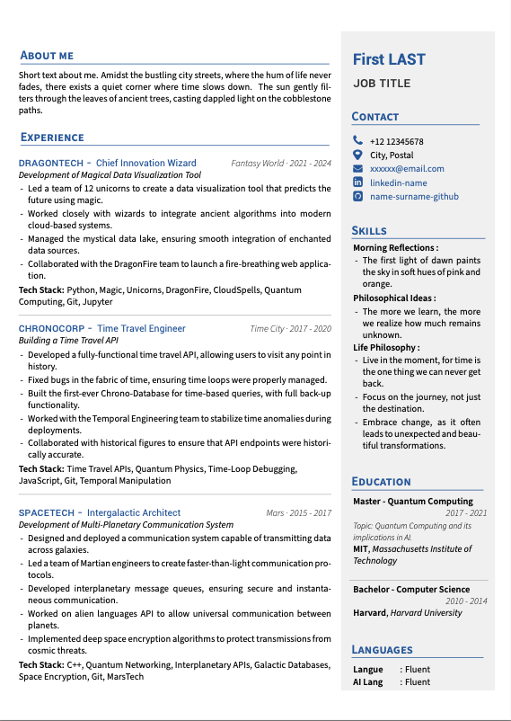

## CV 2-column templates

CV templates modified from Awesome CV templates, updated with my preferred layout and section macros

 

## Quick Start

* [**Edit Awesome Résumé on OverLeaf.com**](https://www.overleaf.com/latex/templates/awesome-cv/tvmzpvdjfqxp)

## About Awesome CV

What it Awesome CV? check  [AwesomeCV Documentation](https://github.com/posquit0/Awesome-CV)

## Credit

[**Awesome CV Template**](https://github.com/posquit0/Awesome-CV) the complete version of the template

[**LaTeX**](https://www.latex-project.org) is a fantastic typesetting program that a lot of people use these days, especially the math and computer science people in academia.

[**LaTeX FontAwesome**](https://github.com/furl/latex-fontawesome) is bindings for FontAwesome icons to be used in XeLaTeX.

[**Roboto**](https://github.com/google/roboto) is the default font on Android and ChromeOS, and the recommended font for Google’s visual language, Material Design.

[**Source Sans Pro**](https://github.com/adobe-fonts/source-sans-pro) is a set of OpenType fonts that have been designed to work well in user interface (UI) environments.

